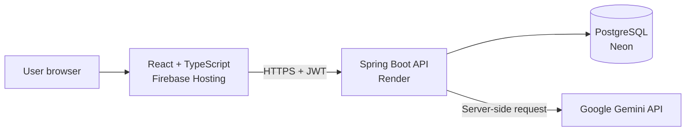

# Job Application Tracker

[](https://openjdk.org/)
[](https://spring.io/projects/spring-boot)
[](https://react.dev/)
[](https://www.typescriptlang.org/)
[](https://www.postgresql.org/)

A full-stack portfolio application for organizing a job search, tracking every application, planning follow-ups and measuring progress. The project also uses Google Gemini to extract vacancy requirements and compare them with the user's skills.

**[Live application](https://hulls-job-tracker.web.app)** | **[API documentation](https://job-application-tracker-api-vr55.onrender.com/swagger-ui/index.html)**

## Highlights

- Secure registration and login with JWT authentication
- Private data ownership: every user can access only their own records
- Create, edit, delete, search, filter and paginate job applications
- Track application statuses: applied, interview, offer and rejected
- Calendar for interviews, follow-ups, deadlines and custom events
- Complete, edit and review upcoming or overdue calendar events
- Statistics dashboard with period filters, application trends, status distribution and follow-up metrics
- Personal skill profile used for AI matching
- Gemini-powered vacancy analysis with required skills, optional skills, seniority and English level extraction
- Skill-gap result with match percentage, matched skills and missing skills
- English, Ukrainian and Slovak interface languages
- Light and dark themes
- Responsive interface with accessible forms, dialogs and feedback states
- OpenAPI/Swagger documentation

## Architecture



The Gemini key stays on the backend and is never exposed to the browser. Spring Security validates the JWT before protected requests reach the application, calendar, statistics or AI services.

## Technology Stack

### Backend

- Java 21 and Spring Boot 4
- Spring MVC, Spring Security and OAuth2 Resource Server
- Spring Data JPA and Hibernate
- PostgreSQL and Flyway migrations
- Bean Validation
- Google Gemini REST API integration
- Springdoc OpenAPI
- Maven, JUnit and Mockito

### Frontend

- React 19 and TypeScript
- Vite
- React Router
- TanStack Query
- Lucide icons
- Vitest and Testing Library
- Custom responsive design with light and dark themes

### Infrastructure

- Docker Compose for local PostgreSQL
- Neon for the production PostgreSQL database
- Render for the Spring Boot API
- Firebase Hosting for the frontend
- GitHub Actions for frontend deployment

## Project Structure

```text
job-application-tracker/
|-- frontend/                         React application
|   |-- src/api/                      Typed API clients
|   |-- src/components/               Shared UI components
|   |-- src/i18n/                     Interface translations
|   `-- src/pages/                    Application pages
|-- src/main/java/com/bahen/jobtracker/
|   |-- application/                  Application CRUD and filtering
|   |-- auth/                         Login and JWT handling
|   |-- calendar/                     Calendar events and reminders
|   |-- skillgap/                     Gemini analysis and skill matching
|   |-- statistics/                   Aggregated dashboard data
|   |-- user/                         Accounts and personal skills
|   `-- config/                       Security, CORS and OpenAPI
|-- src/main/resources/db/migration/  Flyway database migrations
|-- src/test/                         Backend tests
|-- compose.yaml                      Local PostgreSQL
|-- Dockerfile                        Backend production image
|-- render.yaml                       Render deployment blueprint
`-- pom.xml                           Maven configuration
```

## Running Locally

### Requirements

- Java 21
- Node.js and npm
- Docker Desktop

### 1. Clone the repository

```bash
git clone https://github.com/hullss/job-application-tracker.git
cd job-application-tracker
```

### 2. Start PostgreSQL

Make sure Docker Desktop is running, then execute:

```bash
docker compose up -d
```

Docker creates a local `job_tracker` database on port `5432` using the development credentials from `compose.yaml`.

### 3. Configure the backend

The only required local secret is a Base64-encoded JWT key containing at least 32 bytes.

PowerShell:

```powershell
$env:JWT_SECRET="replace-with-a-base64-encoded-secret"
$env:GEMINI_API_KEY="replace-with-your-google-ai-studio-key"
```

`GEMINI_API_KEY` is optional. The application works without it, but AI skill-gap analysis will be unavailable.

### 4. Start the backend

Windows:

```powershell
.\mvnw.cmd spring-boot:run
```

macOS or Linux:

```bash
./mvnw spring-boot:run
```

The API runs at `http://localhost:8080`. Swagger UI is available at `http://localhost:8080/swagger-ui/index.html`.

### 5. Start the frontend

Open another terminal:

```bash
cd frontend
npm install
npm run dev
```

Open `http://localhost:5173`.

## Environment Variables

| Variable | Required | Description |
| --- | --- | --- |
| `JWT_SECRET` | Yes | Base64-encoded signing secret containing at least 32 bytes |
| `SPRING_DATASOURCE_URL` | Production | PostgreSQL JDBC URL; defaults to the local Docker database |
| `SPRING_DATASOURCE_USERNAME` | Production | PostgreSQL username |
| `SPRING_DATASOURCE_PASSWORD` | Production | PostgreSQL password |
| `CORS_ALLOWED_ORIGINS` | Production | Comma-separated frontend origins allowed to call the API |
| `GEMINI_API_KEY` | For AI analysis | Google AI Studio API key stored only on the backend |
| `GEMINI_MODEL` | No | Gemini model name; uses the configured default when omitted |
| `VITE_API_URL` | Frontend build | Public backend URL used by the React application |

Never commit real secrets to the repository. Configure production values through the hosting provider's environment settings.

## Main API Endpoints

| Area | Method and endpoint | Purpose |
| --- | --- | --- |
| Authentication | `POST /api/auth/register` | Create an account |
| Authentication | `POST /api/auth/login` | Receive a JWT access token |
| Applications | `GET /api/applications` | List, search, filter and paginate applications |
| Applications | `POST /api/applications` | Create an application |
| Applications | `GET /api/applications/{id}` | Get one application |
| Applications | `PUT /api/applications/{id}` | Update an application |
| Applications | `DELETE /api/applications/{id}` | Delete an application |
| Calendar | `GET /api/events` | List events within a date range |
| Calendar | `POST /api/applications/{id}/events` | Add an event to an application |
| Calendar | `PUT /api/events/{id}` | Edit an event |
| Calendar | `PATCH /api/events/{id}/complete` | Mark an event as completed |
| Calendar | `DELETE /api/events/{id}` | Delete an event |
| Skills | `GET /api/profile/skills` | List the current user's skills |
| Skills | `POST /api/profile/skills` | Add a skill |
| Skills | `DELETE /api/profile/skills/{id}` | Remove a skill |
| AI analysis | `POST /api/applications/{id}/skill-gap` | Analyze a vacancy and calculate the skill match |
| Statistics | `GET /api/statistics/overview` | Get statistics for the selected period |

Except for registration, login, health checks and API documentation, endpoints require an `Authorization: Bearer <token>` header.

## Tests and Quality Checks

Backend tests:

```powershell
.\mvnw.cmd test
```

Frontend tests, linting and production build:

```bash
cd frontend
npm test
npm run lint
npm run build
```

## Deployment

The production application is split into three independently managed services:

1. Firebase Hosting serves the compiled React frontend.
2. Render builds and runs the Spring Boot API from the repository Dockerfile.
3. Neon stores production data in PostgreSQL.

Pushes to the `main` branch trigger the configured frontend and backend deployment workflows.

## Author

Built by [hullss](https://github.com/hullss) as a portfolio project for practicing production-style full-stack development with Java, Spring Boot, React, PostgreSQL and generative AI.
